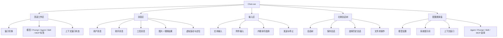
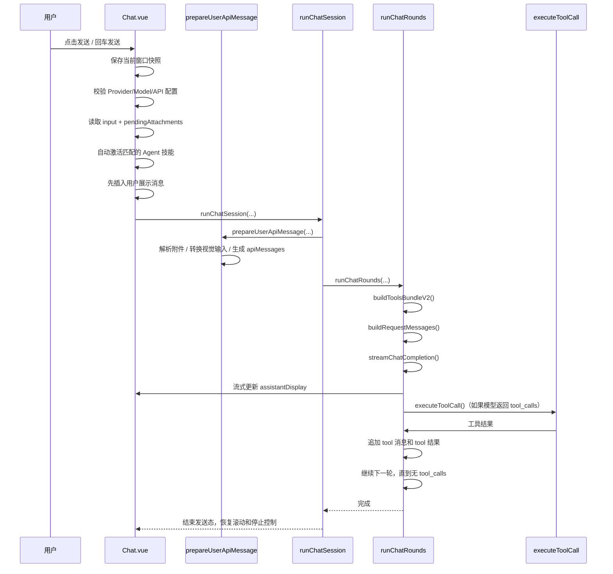

# Chat 页面内部模块说明

本文档用于补充 `docs/当前项目梳理与模块关系图.md`，专门解释聊天页当前的内部结构。

目标有两个：

1. 帮助后续开发者快速读懂 `src/views/pages/chat/Chat.vue`
2. 明确聊天页里哪些逻辑已经拆分，哪些复杂度还集中在页面本体

## 1. 先给结论

当前的 `Chat.vue` 不是普通聊天页，而是一个“AI 工作台容器”。

它同时承担了：

- 多聊天窗口管理
- 会话读写和草稿保护
- Provider / Model / Agent / Prompt / Skill / MCP 选择
- 上下文窗口裁剪
- 联网搜索和工具调用
- 图片 / 视频生成分流
- 附件解析
- 流式响应渲染
- 工具执行展示
- 聊天列表性能优化

也就是说，这个页面实际上把“聊天 UI 层 + AI 编排层 + 一部分状态持久化层”都包进来了。

## 2. 当前文件和依赖关系

Chat 页相关代码主要分成三层：

### 2.1 页面容器

- `src/views/pages/chat/Chat.vue`

职责：

- 页面状态总控
- 请求编排
- 工具注册与执行
- 会话与窗口持久化
- 和配置系统、MCP、技能系统的连接

### 2.2 子组件层

`Chat.vue` 当前按异步组件拆出了几块 UI：

- `ChatComposerPanel.vue`
  - 输入框、快捷按钮、内联选择器、待发送附件
- `ChatToolMessage.vue`
  - 工具消息展示
- `ChatAssistantMedia.vue`
  - 助手返回的图片 / 视频展示
- `ChatUserAttachments.vue`
  - 用户消息附件展示
- `ChatContextWindowPreview.vue`
  - 上下文窗口预算和预览
- `SessionTree.vue`
  - 会话树和保存会话弹窗

这说明 Chat 页已经开始做 UI 层拆分，但“状态和行为编排”还主要留在 `Chat.vue`。

### 2.3 utils 层

Chat 页高度依赖 `src/utils/` 下的能力模块：

- `chatContextWindow.js`
  - 上下文裁剪和预算计算
- `chatWindowStore.js`
  - 多窗口状态持久化
- `chatPromptTooling.js`
  - Prompt / Skill / MCP 的系统提示词拼装规则
- `mcpClient.js`
  - MCP client 创建和 keepAlive 复用
- `chatImageGeneration.js`
  - 图片 / 视频生成结果识别和兼容逻辑
- `chatRequestCompat.js`
  - 不同接口兼容逻辑、请求字符预算计算
- `chatInlinePicker.js`
  - `@智能体`、`/prompt`、`/skill`、`/mcp` 的内联选择
- `toolVisionContext.js`
  - 工具结果图片自动回灌为视觉上下文
- `chatToolDisplay.js`
  - 工具结果格式化展示
- `chatAgentRun.js`
  - agent_run 工具执行流合并与展示辅助

这层划分已经比较健康：通用规则在 `utils`，但 orchestrator 仍在 `Chat.vue`。

## 3. 页面内部结构图

## 4. Chat.vue 里的状态分区

如果从源码组织来看，`Chat.vue` 的状态大致能分成 8 组。

### 4.1 当前会话状态

页面里有一个核心 `session`：

- `session.messages`
- `session.apiMessages`

两者职责不同：

- `messages`
  - 给 UI 展示的消息列表
  - 会带图片、工具展示状态、thinking 展开状态等前端字段
- `apiMessages`
  - 真正发给模型的消息
  - 更接近 LLM API 所需格式

这是 Chat 页最关键的一个设计：展示态和请求态分离。

### 4.2 多窗口状态

页面不是单会话模式，而是“多聊天窗口”模式。

核心状态包括：

- `chatWindows`
- `activeChatWindowId`
- `activeChatWindow`
- `chatWindowTabs`

每个窗口不仅保存消息，还保存整套工作上下文，包括：

- 会话绑定路径
- 当前 Agent / Provider / Model
- Prompt 选择
- Skill / MCP 选择
- 输入框内容
- 待发送附件
- 上次阅读位置和未读数

它通过 `chatWindowStore.js` 写入本地持久化。

### 4.3 聊天配置状态

Chat 页本身也维护一套工作配置：

- `selectedAgentId`
- `selectedProviderId`
- `selectedModel`
- `basePromptMode`
- `selectedPromptId`
- `customSystemPrompt`
- `selectedSkillIds`
- `manualMcpIds`
- `webSearchEnabled`
- `toolMode`
- `thinkingEffort`
- `imageGenerationMode`
- `videoGenerationMode`

这组状态决定了“这一轮聊天到底如何构造请求”。

### 4.4 输入态

输入态包括：

- `input`
- `pendingAttachments`
- 内联选择器相关状态
  - `inlineAgentQuery`
  - `inlineCommandMode`
  - `inlineCommandType`
  - `inlineCommandQuery`

也就是说，输入区不只是一个 textarea，而是一个带命令层的编排入口。

### 4.5 上下文窗口状态

Chat 页把上下文窗口做成了可视化预算系统。

主要状态包括：

- `contextWindowConfig`
- `contextWindowResolvedOptions`
- `contextWindowStats`
- `contextWindowPreviewState`

这部分既管“请求前裁剪”，也管“给用户解释为什么有些历史被裁掉”。

### 4.6 工具态

工具相关状态包括：

- `refreshingMcpTools`
- `mcpPromptCatalog`
- `mcpToolsRevision`
- `mcpToolCatalogRevision`
- `mcpPinnedToolHintsRevision`

它们服务于两个目标：

- 动态构建当前可调用工具集
- 在 compact 模式下给模型提供 MCP 工具目录索引

### 4.7 运行态

请求运行时主要看这些状态：

- `sending`
- `abortController`
- `showModelModal`
- `showSystemPromptModal`
- `showContextWindowModal`

其中 `sending` 和 `abortController` 是请求控制的关键。

### 4.8 滚动和性能态

Chat 页已经开始做性能优化，因此有一批专门状态：

- `autoScrollEnabled`
- `isAtBottom`
- `visibleHeavyChatMessageIds`
- `chatVirtualizedEnabled`
- `renderedChatRange`
- `stickyChatBubble`

这说明聊天列表已经不再是“全量简单渲染”，而是做了大列表优化。

## 5. 从发送到响应的主链路

`send()` 是聊天页最重要的入口函数之一。

它的大致流程如下：

这个流程体现了一个重要事实：

`Chat.vue` 不只是“发一次请求然后展示结果”，它是一个带工具回合循环的 agent runtime。

## 6. 请求构造是怎么做的

### 6.1 先构造系统提示词

系统提示词不是单一字符串，而是多个来源拼出来的：

- 当前 Prompt
- 自定义系统提示词
- Skill 说明
- MCP 工具目录
- Web 搜索说明
- Tool mode 说明

对应代码集中在：

- `systemContent`
- `basePromptText`
- `skillsPromptText`
- `mcpToolCatalogPromptText`
- `webSearchPromptText`

也就是说，Chat 页本质上在动态生成一份“当前会话专属系统提示词”。

### 6.2 再裁剪历史上下文

历史消息不会原样全部送给模型，而是经过：

- `buildChatContextWindow(...)`
- `buildChatContextWindowRuntimeOptions(...)`

上下文窗口策略支持：

- `aggressive`
- `balanced`
- `wide`
- `custom`

同时支持历史焦点策略：

- `recent`
- `balanced`
- `attachments`

这部分直接决定：

- 保留多少轮
- 附件历史保多少
- 是否为工具定义和系统提示词预留预算

### 6.3 最后生成 request messages

真正发请求前，`buildRequestMessages()` 会做几件兼容性处理：

- 注入 `system` 消息
- 把 `apiMessages` 裁剪成最终请求消息
- 按需保留或移除 `reasoning_content`
- 对部分网关兼容 `tool_call id` 格式
- 对不支持视觉输入的接口回退为文本
- 对不支持工具续跑的接口回退为纯文本工具结果

这层逻辑说明：Chat 页已经明显适配了多种“不完全标准”的 OpenAI 兼容接口。

## 7. 工具系统是怎么接进来的

Chat 页当前有三类工具。

### 7.1 内置工具

内置工具包括：

- `web_search`
- `web_read`
- `use_skill`
- `use_skills`
- `read_skill_file`
- `run_skill_script`
- `activate_all_agent_skills`
- `mcp_discover`
- `mcp_call`

这些工具不是 MCP 服务直接暴露的，而是 Chat 页自己包装出来的统一工具接口。

### 7.2 MCP 工具

MCP 工具通过 `buildToolsBundleV2()` 动态构建。

它会根据当前选择的 MCP server：

- 列出工具
- 过滤 allowTools
- 转成 provider 可接受的 function tool schema
- 建立 `tool name -> server/tool` 映射

### 7.3 工具模式

工具模式有三种：

- `expanded`
  - 把 MCP 工具逐个注册成模型函数
- `compact`
  - 只给模型 `mcp_discover` 和 `mcp_call`
  - 再通过系统提示词附带 MCP 工具目录
- `auto`
  - 工具太多时自动切到 compact

这是 Chat 页很关键的一层设计，它是在用“工具展开模式”控制 token 和 schema 体积。

## 8. 工具执行链路

当模型返回 `tool_calls` 后，Chat 页会进入“工具回合”。

主链路大致是：

1. `runChatRounds()` 识别 `tool_calls`
2. `executeToolCall()` 根据 `toolMap` 找到工具归属
3. 如需审批，调用 `confirmToolCall()`
4. 实际执行：
   - 内置 web 工具
   - skill 读取 / skill 脚本
   - MCP 工具
5. 结果转成：
   - `session.apiMessages` 中的 `role: tool`
   - `session.messages` 中的工具展示消息
6. 若工具结果含图片，还可能回灌为视觉上下文
7. 继续下一轮模型请求

这个流程是 Chat 页最接近 agent runtime 的部分。

## 9. 附件处理链路

附件不是简单上传，而是要先做本地解析。

主要过程是：

1. 用户选择文件
2. `appendPendingFiles()` 加入待发送附件
3. `ensureAttachmentParsed()` 解析附件
4. 根据类型区分：
   - 图片
   - 直接文本
   - worker 解析文本
   - 可转换文本
5. `prepareUserApiMessage()` 决定：
   - 图片走 vision 输入
   - 或降级为文本说明
   - 或把附件正文拼进 user content

所以附件系统本质上是“消息预处理器”，不是简单的 UI 附件栏。

## 10. 会话和窗口持久化怎么做

### 10.1 窗口持久化

多窗口状态通过：

- `captureChatWindowSnapshot()`
- `persistChatWindowsState()`
- `applyChatWindowSnapshot()`

和 `chatWindowStore.js` 联动。

保存的是“整个工作现场”，不是单条消息。

### 10.2 会话文件持久化

聊天记录还支持绑定到会话文件。

相关入口包括：

- `openSaveSessionModal()`
- `runSessionAutosave()`
- `loadSessionFromFile()`
- `closeActiveSession()`

右侧的 `SessionTree.vue` 负责：

- 目录树
- 会话选择
- 保存会话
- 重命名 / 删除 / 打开文件夹

这套机制让 Chat 页同时支持：

- 临时聊天窗口
- 持久化会话文件

## 11. 子组件拆分现状

当前可以把 Chat 页的拆分状态理解成：

### 11.1 已经拆出去的

- 输入区 UI
- 工具消息 UI
- 媒体消息 UI
- 用户附件 UI
- 上下文窗口预览 UI
- 会话树 UI

### 11.2 还留在 Chat.vue 的

- 会话与窗口状态同步
- Prompt / Skill / MCP / Agent 编排
- 请求构造
- 工具注册
- 工具执行
- 媒体生成兼容逻辑
- 滚动与虚拟化
- 多数 watch / 生命周期逻辑

所以当前拆分主要还是“视图拆分”，而不是“状态和行为拆分”。

## 12. 性能策略

Chat 页已经开始面对长对话和重消息渲染问题，因此加入了几层性能策略：

- 大消息延迟渲染
- 聊天列表虚拟区间渲染
- heavy message 可见性观察
- sticky chat bubble
- 自动滚动和底部状态控制
- code block 自动折叠阈值

这意味着：

- 性能问题已经被显式处理
- 但相关逻辑也让 `Chat.vue` 的复杂度继续上升

## 13. 为什么 Chat.vue 现在这么大

因为它把下面三种角色合在了一起：

1. 页面容器
2. agent 编排器
3. 会话运行时控制器

这是当前文件体量和复杂度高的根本原因。

如果只拆 UI 子组件，文件会稍微清爽一点，但真正复杂的地方还在页面本体。

## 14. 后续最适合继续拆的方向

如果后续要继续治理 Chat 页，建议优先按行为域拆，而不是再拆更多纯展示组件。

优先顺序建议如下：

### 14.1 第一优先级：请求编排层

可单独抽出：

- `chatSessionRuntime`
- `chatToolRuntime`
- `chatMediaRuntime`

把 `runChatSession()`、`runChatRounds()`、`executeToolCall()` 这些函数搬出页面。

### 14.2 第二优先级：窗口与会话层

可单独抽出：

- `chatWorkspaceState`
- `chatSessionPersistence`

把窗口切换、快照、autosave、会话文件绑定这部分从页面里移走。

### 14.3 第三优先级：滚动与虚拟化层

可单独抽出：

- `useChatScrollController`
- `useChatVirtualList`

这样会明显降低页面里的 watch 和 DOM observer 密度。

## 15. 接手修改时怎么定位

如果后面要改 Chat 页，建议按需求类型找入口：

- 改输入区交互：
  - `ChatComposerPanel.vue`
  - `handleInputKeydown()`
  - `send()`
- 改上下文窗口：
  - `chatContextWindow.js`
  - `contextWindow*` 相关 computed
- 改工具注册或 tool mode：
  - `buildToolsBundleV2()`
  - `INTERNAL_TOOL_SPECS`
- 改工具执行：
  - `executeToolCall()`
  - `confirmToolCall()`
- 改会话保存：
  - `SessionTree.vue`
  - `runSessionAutosave()`
  - `loadSessionFromFile()`
- 改图片 / 视频生成：
  - `runImageGenerationRound()`
  - `runVideoGenerationRound()`
  - `chatImageGeneration.js`
- 改长列表渲染性能：
  - `chatVirtualizedEnabled`
  - `renderedChatMessages`
  - `setupChatMessageVisibilityObserver()`

## 16. 最后的判断

当前 Chat 页已经是项目里最像“应用内运行时”的模块。

它的优点是：

- 功能完整
- 编排能力强
- 和 Skill / MCP / Agent / Notebook 的联动已经成型

它的风险也很明确：

- 复杂状态集中
- 行为逻辑集中
- 页面层承载了太多 runtime 责任

所以后续如果继续迭代 Chat，最值得做的不是继续补按钮，而是把运行时行为逐步从 `Chat.vue` 里拆出去。
