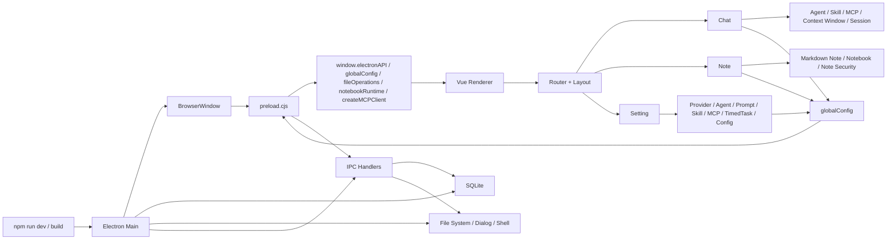
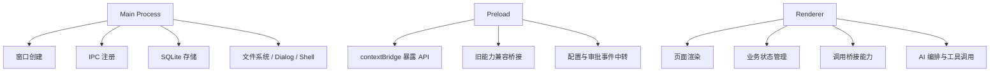
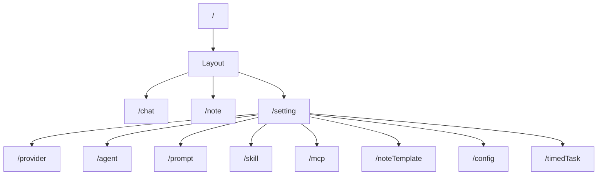

# 当前项目梳理与模块关系图

本文档基于现有 `docs/项目架构与运行逻辑.md`，再结合当前仓库代码做一次“面向现状”的梳理。

目标不是重复原文档，而是把两件事合在一起：

1. 给出当前项目的模块关系图和关键调用链
2. 从代码现状出发，说明这个项目现在到底是什么、主要模块分别在做什么、哪里已经稳定、哪里开始变复杂

## 1. 一句话理解当前项目

当前项目已经不只是“AI 智能笔记”，而是一个本地优先的 AI 桌面工作台：

- 用 `Electron` 提供桌面容器、本地文件系统、SQLite、系统对话框、Shell 能力
- 用 `Vue 3 + Naive UI` 承接页面和交互
- 用 `preload` 把主进程能力安全桥接到前端
- 用“聊天 / 笔记 / 设置中心”三大业务域承接实际功能

从产品形态看，它更接近：

- 一个可聊天的 AI 工作台
- 一个带 Notebook 能力的本地知识库
- 一个能配置 Provider / Agent / Skill / MCP / TimedTask 的桌面控制台

## 2. 总体模块关系图

这张图对应当前代码的真实分层：

- 主进程入口：`electron/main.cjs`
- 桥接入口：`electron/preload.cjs`
- 前端入口：`src/main.js`
- 页面入口：`src/router/index.js`、`src/router/routes.js`

## 3. 目录和职责映射

### 3.1 核心入口

- `package.json`
  - 定义开发、构建、启动脚本
  - `main` 指向 `electron/main.cjs`
- `electron/main.cjs`
  - Electron 主进程入口
- `electron/preload.cjs`
  - 安全桥接入口
- `src/main.js`
  - Vue 应用入口
- `src/router/routes.js`
  - 业务页面路由清单

### 3.2 主要目录

- `electron/`
  - 桌面侧能力
  - 包括主进程、SQLite、preload、桥接工具
- `electron/preload-utils/`
  - 预加载层的业务能力实现
  - 包括全局配置、文件操作、MCP、Notebook Runtime、Web 操作、云同步等
- `src/views/pages/chat/`
  - 聊天主页面和相关组件
- `src/views/pages/note/`
  - 笔记、Markdown 编辑器、Notebook 编辑器、文件树
- `src/views/pages/setting/`
  - 全局配置和各类管理页面
- `src/utils/`
  - 业务编排和通用能力层
  - 是 renderer 端的“中枢”

## 4. 启动和运行主链路

### 4.1 应用启动

启动顺序可以概括成：

1. `npm run dev` 启动 Vite 和 Electron
2. `electron/main.cjs` 创建 `BrowserWindow`
3. `BrowserWindow` 先执行 `preload.cjs`
4. `preload.cjs` 通过 `contextBridge` 暴露受控 API
5. `src/main.js` 挂载 Vue 应用
6. `configListener.init()` 初始化全局配置监听
7. `initTimedTaskRunner()` 启动定时任务调度

### 4.2 进程职责

主进程、preload、renderer 之间的边界现在是比较清晰的：

- 主进程管系统能力和持久化
- preload 管安全暴露和兼容层
- renderer 管页面和业务编排

这也是当前项目比较健康的一点：底层分层并不乱，复杂度主要集中在业务页面本身。

## 5. 当前页面结构

当前路由结构大致如下：

外层统一由 `Layout.vue` 承接左侧导航和内容区，业务页主要分成三块：

- `聊天`
- `笔记`
- `设置`

## 6. 三大业务域怎么理解

### 6.1 Chat：AI 工作台

`Chat.vue` 是当前最复杂、也最核心的页面。

它不只是一个对话框，而是一套 AI 工作台，里面同时管理：

- 多聊天窗口
- 会话持久化
- Provider / Model 选择
- Agent / Prompt / Skill / MCP 选择与激活
- 上下文窗口裁剪
- 附件处理
- 工具调用
- 图片 / 视频生成模式

它依赖的核心工具层包括：

- `src/utils/chatContextWindow.js`
- `src/utils/chatWindowStore.js`
- `src/utils/chatPromptTooling.js`
- `src/utils/chatImageGeneration.js`
- `src/utils/mcpClient.js`
- `src/utils/toolResultForModel.js`

从业务定位上看，Chat 已经是“AI 编排入口”，不是简单聊天页。

### 6.2 Note：本地知识库

`Note.vue` 负责整个笔记域，已经支持两类内容：

- Markdown 笔记：`.md`
- 超级笔记 / Notebook：`.ipynb`

对应的类型定义在：

- `src/utils/noteTypes.js`

这个页面当前承接的能力其实很强：

- 右侧文件树
- 多标签打开笔记
- Markdown 编辑
- Notebook 编辑和运行
- 笔记密码保护
- 解锁、改密、清密、重置密码
- 附件目录清理

也就是说，这部分已经不是纯编辑器，而是“本地笔记系统”。

### 6.3 Notebook：内置 Python 工作区

`NotebookEditor.vue` 是笔记域里最重的子模块。

它已经具备比较完整的 Notebook 运行能力：

- Cell 增删改查
- Markdown / Code Cell
- 运行单个 Cell、运行全部
- 中断执行、重启 Kernel
- Python 检测
- 依赖安装
- Jupyter Runtime 管理
- Python LSP 检查
- 发送内容到聊天页

它背后依赖的运行链路是：

- renderer：`src/utils/notebookRuntime.js`
- preload：`electron/preload-utils/notebook-runtime.js`
- helper：`electron/preload-utils/helpers/notebook_runtime.py`

这说明项目不是“展示 Notebook UI”，而是真的把本地 Python 运行时接进来了。

### 6.4 Setting：项目控制台

设置域不是传统意义上的“偏好设置”，而是整个系统的控制中心。

当前设置页已经覆盖：

- `Provider`
  - 配置模型服务商、接口地址、API Key、模型列表
- `Agent`
  - 配置智能体，绑定 Provider / Model / Prompt / Skill / MCP
- `Prompt`
  - 管理提示词
- `Skill`
  - 导入目录技能、导入 `SKILL.md`、管理内联技能
- `MCP`
  - 管理 MCP 服务器、传输方式、可用工具
- `TimedTask`
  - 管理定时任务和触发规则
- `Config`
  - 全局主题、数据目录、Notebook Runtime、联网搜索、同步、上下文窗口、配置安全等

这部分说明项目已经明显具备“平台化”倾向，而不是单功能工具。

## 7. 数据和状态是怎么流动的

### 7.1 全局配置流

全局配置主入口是：

- renderer：`src/utils/configListener.js`
- preload：`electron/preload-utils/global-config.js`

整体模式是：

1. renderer 启动时读取当前配置
2. 页面通过 `globalConfig` 提供的方法修改配置
3. preload / main 将配置变更事件回传给 renderer
4. 页面响应式更新

配置内容已经很丰富，包括：

- 主题
- Chat 默认配置
- Note 配置
- Provider / Agent / Prompt / Skill / MCP / TimedTask
- 数据根目录
- 云同步配置
- Web 搜索配置
- 配置安全

### 7.2 本地存储流

当前本地存储主要分两层：

- SQLite 主存储
  - 在 `electron/db.cjs`
- 前端桥接存储
  - 在 `src/utils/electronStorage.js`

SQLite 当前承接的核心数据包括：

- `app_state`
- `users`
- `kv_store`
- `chat_sessions`

也就是说，项目已经把“用户态、配置态、聊天态”真正沉到了本地数据库里。

### 7.3 聊天窗口状态流

聊天窗口相关状态由：

- `src/utils/chatWindowStore.js`

统一读写。

它保存的不只是消息，还包括：

- 当前活动聊天窗口
- 窗口标题
- 当前会话路径
- 选中的 Agent / Provider / Model
- Prompt / Skill / MCP 选择状态
- 输入框内容
- 未读计数

这让 Chat 页具备了一个“小型工作区”的状态恢复能力。

## 8. 内置能力和平台化特征

当前项目一个很重要的特征是：它已经有“内置系统能力”。

在 `electron/preload-utils/global-config.js` 中，可以看到项目会自动准备内置对象，例如：

- 内置 MCP Server
  - 笔记
  - 配置
  - 会话历史
  - 智能体编排
- 内置 Skill
  - 笔记查阅与记录
  - 配置管理
  - 会话历史
  - 子智能体编排
- 内置 Prompt
- 内置 Agent

这意味着：

- 项目本身就能通过自己的 MCP 和 Skill 来操作自己的数据
- Chat 页并不是孤立的，它已经能接入笔记、配置、会话、Agent 编排
- 整个系统带一点“自举式 AI 平台”的味道

这是当前项目和普通笔记工具差异最大的一点。

## 9. 当前项目的成熟度判断

从代码现状看，可以把项目大致分成三类状态。

### 9.1 已经比较成熟的部分

- Electron 主进程、preload、renderer 的分层
- 本地 SQLite 存储
- 路由和布局组织
- 设置域的功能覆盖
- Notebook Runtime 接入链路
- Chat 的窗口化和会话持久化

这些部分说明项目底层并不是“半成品”，而是已经形成稳定骨架。

### 9.2 功能完整但复杂度偏高的部分

- `src/views/pages/chat/Chat.vue`
- `src/views/pages/note/NotebookEditor.vue`
- `src/views/pages/setting/config/Config.vue`

这几个文件都已经承担了大量编排逻辑、状态控制和 UI 细节。

其中最明显的是 Chat 页：

- 文件体量大
- 状态点很多
- 与 Skill / MCP / Provider / Agent / Session / Attachment / Tooling 强耦合

这类模块说明项目进入了“功能继续长，模块拆分压力也开始出现”的阶段。

### 9.3 目前还偏弱的部分

- 自动化测试覆盖

当前 `package.json` 里存在 `test` 脚本，但仓库中没有看到 `tests/` 目录。这说明：

- 项目已经考虑了测试入口
- 但测试体系目前还没有跟上功能复杂度

如果后面继续扩大功能，测试会成为比较现实的补课点。

## 10. 当前项目更像什么

如果只看名字，容易把它理解成“AI 笔记应用”。

但结合代码现状，更贴切的描述应该是：

> 一个运行在本地桌面上的 AI 工作台，聊天是入口，笔记是知识载体，设置中心是系统编排面板，Notebook 和 MCP/Skill/Agent 让它具备了扩展和自动化能力。

也可以再拆得更通俗一些：

- `Chat` 是操作台
- `Note` 是知识库
- `Setting` 是后台控制台
- `Electron + Preload + SQLite` 是地基

## 11. 推荐的源码阅读顺序

如果要继续接手或开发这个项目，建议按下面顺序读代码：

1. `package.json`
   先看脚本和依赖，知道项目怎么启动、怎么构建
2. `electron/main.cjs`
   先弄清楚主进程提供了哪些系统能力
3. `electron/preload.cjs`
   看看哪些能力被暴露给前端
4. `src/main.js`
   看 renderer 启动时做了什么初始化
5. `src/router/routes.js`
   快速了解页面边界
6. `src/utils/configListener.js`
   理解全局配置如何流动
7. `src/views/pages/chat/Chat.vue`
   理解最核心的业务入口
8. `src/views/pages/note/Note.vue` 和 `NotebookEditor.vue`
   理解知识库和 Notebook 能力
9. `src/views/pages/setting/*`
   理解系统配置能力如何组织

按这个顺序读，会比直接扑进 `Chat.vue` 轻松很多。

## 12. 当前项目的重点结论

最后收成几条最重要的判断：

1. 项目架构主链路是清楚的，文档和代码基本一致，属于“设计已经落地”的状态。
2. 项目定位已经从“AI 笔记工具”扩展为“本地 AI 工作台”。
3. 三大业务域中，`Chat` 是核心入口，`Note` 是知识承载，`Setting` 是系统编排中心。
4. Notebook、MCP、Skill、Agent、TimedTask 这些能力说明项目明显具备平台化方向。
5. 当前最大的不是底层架构问题，而是核心页面的复杂度正在上升，后续更需要模块拆分和测试补强。

## 13. 后续可继续补的文档方向

如果后面继续完善文档，建议优先补下面三类：

- `Chat` 页内部模块拆分说明
  - 把窗口、会话、上下文、工具、附件、模型参数分别拆开
- `Notebook Runtime` 故障排查文档
  - Python 检测失败、依赖缺失、Kernel 启动失败、LSP 异常怎么排查
- `Setting` 域配置字典
  - 把 Provider / Agent / Skill / MCP / TimedTask 的关键字段解释补齐
