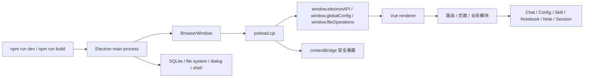

# 项目架构与运行逻辑

本文档基于当前已独立化后的 Electron + Vue 3 项目整理，重点说明项目结构、启动链路、进程通信、数据存储和核心页面运行逻辑，便于后续排查问题和继续做体积优化。

## 1. 项目定位

当前项目已经从 uTools 依赖模式转为独立 Electron 桌面应用：

- 主进程负责窗口创建、IPC 注册、文件系统与 SQLite 能力
- preload 负责把主进程能力安全暴露给渲染进程
- renderer 负责 Vue 页面、路由、业务交互和模型编排
- 原先依赖 uTools 的部分能力，已逐步迁移为 Electron 语义或本地兼容桥接

## 2. 总体架构

## 3. 目录结构

### 3.1 关键入口

- [`package.json`](file:///E:/FigtueMobi/figturmobi%20ai%20tools/package.json)
  - 定义 `dev`、`build`、`build:renderer`、`start`
  - `main` 指向 `electron/main.cjs`
  - `build` 配置 `electron-builder`
- [`vite.config.js`](file:///E:/FigtueMobi/figturmobi%20ai%20tools/vite.config.js)
  - Vue 打包入口
  - `manualChunks` 负责把大依赖拆成独立 chunk
- [`electron/main.cjs`](file:///E:/FigtueMobi/figturmobi%20ai%20tools/electron/main.cjs)
  - 主进程入口
- [`electron/preload.cjs`](file:///E:/FigtueMobi/figturmobi%20ai%20tools/electron/preload.cjs)
  - preload 入口
- [`src/main.js`](file:///E:/FigtueMobi/figturmobi%20ai%20tools/src/main.js)
  - renderer 入口

### 3.2 常见子模块

- `src/views/pages/chat`
  - Chat 主页面
  - Chat 相关子组件
- `src/views/pages/setting`
  - Config / Provider / Skill / Prompt / MCP / TimedTask 等配置页面
- `src/utils`
  - 运行时工具、存储桥接、上下文窗口、Notebook、文件操作等
- `electron/preload-utils`
  - 主进程与渲染进程之间的核心桥接逻辑

## 4. 启动顺序

### 4.1 开发模式

执行 `npm run dev` 时：

1. `concurrently` 同时启动 Vite 和 Electron
2. `vite` 提供 renderer 开发服务器，默认端口 `5173`
3. Electron 主进程启动后，等待 Vite 可用
4. 主进程创建 `BrowserWindow`
5. `BrowserWindow` 加载 `http://localhost:5173`
6. preload 先于页面执行，注入 `electronAPI` 和各类业务桥接对象
7. Vue 应用挂载，`src/main.js` 触发配置监听与定时任务初始化

### 4.2 生产模式

执行 `npm run build` 时：

1. 先运行 `vite build`
2. 生成 `dist/` 下的 renderer 静态资源
3. 再运行 `electron-builder`
4. 打包 `electron/**/*`、`dist/**/*`、`package.json`
5. 产出安装包和解包目录

## 5. 进程职责

### 5.1 Main Process

主进程负责以下事情：

- 创建主窗口
- 初始化 SQLite 数据库
- 注册 IPC 通道
- 处理文件系统、对话框、Shell、会话管理、配置同步
- 把配置变化和工具审批事件从 preload/renderer 间转发

### 5.2 Preload

preload 是安全边界：

- 使用 `contextBridge.exposeInMainWorld`
- 仅把需要的能力暴露给 renderer
- 保持 `contextIsolation: true`
- 不让 renderer 直接访问 Node 原生 API

当前 preload 暴露的主要对象包括：

- `window.electronAPI`
- `window.globalConfig`
- `window.fileOperations`
- `window.notebookRuntime`
- `window.webOperations`
- `window.localUser`
- `window.createMCPClient`

### 5.3 Renderer

renderer 负责：

- Vue 组件渲染
- 路由切换
- 页面状态管理
- 调用 `window.electronAPI` 和各类桥接对象
- 组织 AI 聊天、Notebook、配置管理、技能导入等业务流程

## 6. 核心数据流

### 6.1 配置数据流

配置相关流程大致如下：

1. renderer 启动后调用 `configListener.init()`
2. `configListener` 先尝试从 `window.globalConfig.getConfig()` 读取初始配置
3. 如果 preload 提供 `electronAPI.onConfigChanged`，则监听主进程同步来的配置变更
4. 修改配置时，页面调用 `window.electronAPI` 暴露的方法
5. preload / main 负责把变更广播给 renderer

配置核心模块：

- [`src/utils/configListener.js`](file:///E:/FigtueMobi/figturmobi%20ai%20tools/src/utils/configListener.js)
- [`electron/preload-utils/global-config.js`](file:///E:/FigtueMobi/figturmobi%20ai%20tools/electron/preload-utils/global-config.js)

### 6.2 存储数据流

当前存储分两层：

- 主持久层
  - Electron 主进程 SQLite
  - 配置、会话、用户信息等
- 前端桥接层
  - `electronStorage.js`
  - `chatWindowStore.js`

`chatWindowStore` 已从旧的 uTools shim 迁移为 Electron 专用桥接：

- [`src/utils/electronStorage.js`](file:///E:/FigtueMobi/figturmobi%20ai%20tools/src/utils/electronStorage.js)
- [`src/utils/chatWindowStore.js`](file:///E:/FigtueMobi/figturmobi%20ai%20tools/src/utils/chatWindowStore.js)

### 6.3 文件与目录操作

文件系统能力通过 preload 注入：

- `readFile`
- `writeFile`
- `exists`
- `createDirectory`
- `listDirectory`
- `stat`
- `openInFileManager`
- `resolvePath`
- `moveItem`
- `renameItem`

前端侧统一通过：

- [`src/utils/fileOperations.js`](file:///E:/FigtueMobi/figturmobi%20ai%20tools/src/utils/fileOperations.js)

调用，避免页面直接操作底层 API。

### 6.4 Notebook 运行链路

Notebook 相关功能是典型的“前端调用 preload，再由主进程或外部运行环境执行”的链路：

1. Config 页初始化 notebook runtime 配置
2. 页面可检测 Python
3. 可安装依赖
4. 可创建/重启/关闭 Notebook session
5. 所有动作通过 `src/utils/notebookRuntime.js` 进入 preload

相关文件：

- [`src/utils/notebookRuntime.js`](file:///E:/FigtueMobi/figturmobi%20ai%20tools/src/utils/notebookRuntime.js)
- [`electron/preload-utils/notebook-runtime.js`](file:///E:/FigtueMobi/figturmobi%20ai%20tools/electron/preload-utils/notebook-runtime.js)

## 7. Chat 页面运行逻辑

Chat 是当前最复杂的业务页，运行逻辑可以拆成几层：

### 7.1 页面入口

Chat 通过路由进入，页面内部负责：

- 会话管理
- 消息渲染
- 附件处理
- 工具调用
- 模型参数与上下文窗口控制
- Agent / Skill / MCP 组合编排

### 7.2 上下文窗口

上下文窗口逻辑由：

- [`src/utils/chatContextWindow.js`](file:///E:/FigtueMobi/figturmobi%20ai%20tools/src/utils/chatContextWindow.js)

负责。它会根据当前配置和 runtime 参数，计算：

- `maxMessages`
- `maxTurns`
- `keepRecentTurnsFull`
- `maxChars`
- 工具策略

这部分用于控制：

- 历史消息保留策略
- 附件压缩与截断
- 模型输入长度控制

### 7.3 工具调用

Chat 页面会把可用工具整理成不同类别：

- Web 工具
- MCP 工具
- Agent 工具
- Notebook / 文件工具

工具调用的核心目标是：

- 能用工具获取的数据，就不要让模型凭空回答
- 调用后把结果转成可展示内容
- 失败时返回明确错误提示

### 7.4 会话持久化

Chat 窗口状态保存在本地存储层中：

- 当前活跃窗口
- 不同窗口的 session
- 输入框内容
- 选中的 Agent / Provider / Model
- 未读计数

相关实现：

- [`src/utils/chatWindowStore.js`](file:///E:/FigtueMobi/figturmobi%20ai%20tools/src/utils/chatWindowStore.js)

## 8. Config 页面运行逻辑

Config 页是项目最重要的控制中心之一，负责：

- 全局配置查看与编辑
- Notebook runtime 配置
- 数据存储根目录
- 同步配置
- Web Search 配置
- Agent / Provider / Prompt / Skill / MCP / TimedTask 管理

其运行特点：

1. 页面加载后先拉取当前全局配置
2. 对配置编辑采用表单态与提交态分离
3. 目录选择、文件导入导出都通过 Electron API
4. 修改完成后依赖配置变更事件回写页面状态

相关文件：

- [`src/views/pages/setting/config/Config.vue`](file:///E:/FigtueMobi/figturmobi%20ai%20tools/src/views/pages/setting/config/Config.vue)

## 9. Skill 页面运行逻辑

Skill 页面主要处理：

- skill 列表
- 导入 skill 目录
- 导入 `SKILL.md`
- 选择路径
- 预览与管理 skill 元数据

它与 Config 页类似，也依赖 Electron 的 `showOpenDialog` 等能力。

相关文件：

- [`src/views/pages/setting/skill/Skill.vue`](file:///E:/FigtueMobi/figturmobi%20ai%20tools/src/views/pages/setting/skill/Skill.vue)

## 10. 本地存储与兼容层

当前项目在独立 Electron 化后，已经形成一套新的存储与桥接方式：

- `electron/main.cjs`
  - 提供主进程能力
- `electron/preload.cjs`
  - 暴露安全 API
- `electron/preload-utils/db-bridge.js`
  - 兼容 SQLite / fallback storage
- `src/utils/electronStorage.js`
  - 给前端提供统一的存储入口
- `src/utils/chatWindowStore.js`
  - 管理聊天窗口持久化

这里的关键原则是：

- 前端只看桥接层，不直接依赖旧 uTools 运行时
- preload 负责把旧能力替换成 Electron 对应能力
- 若缺少 Electron API，则给出明确错误，而不是悄悄失败

## 11. 打包与拆分策略

当前 `vite.config.js` 已启用手动分包：

- `vendor-ui-core`
- `vendor-md-editor`
- `vendor-highlight`
- `vendor-katex`
- `vendor-codemirror`
- `vendor-pdfjs`
- `vendor-mammoth`
- `vendor-xlsx`
- `vendor-jszip`
- 以及 worker 相关 chunk

这套策略的目标是：

- 避免所有依赖全部塞进一个超大 bundle
- 让高频页面尽量复用公共 chunk
- 为后续继续拆 `Chat` 页和重复 chunk 留余地

当前构建结果仍会提示部分 chunk 超过 500KB，这说明：

- 结构已经变得更清晰
- 但 `Chat`、`codemirror`、`pdfjs`、`mermaid`、`ui-core` 等依赖仍然偏重
- 后续可以继续按页面和功能域做更细粒度拆分

## 12. 当前运行验证状态

最近一轮验证结果：

- `npm run build:renderer` 通过
- `npm run build` 通过

说明当前独立化后的入口、preload、页面依赖和打包链路是可运行的。

## 13. 后续建议

如果继续优化，建议优先顺序是：

1. 继续拆 `Chat` 页的重依赖
2. 清理 preload 中剩余的旧命名，但保留真正运行依赖
3. 针对重复 chunk 再收紧 `manualChunks`
4. 给关键运行链路补一份更偏“故障排查”的说明文档

